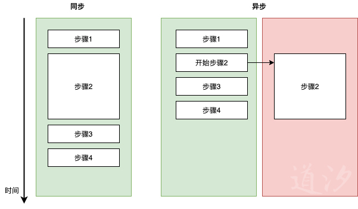

# 单线程的JavaScript如何通过事件循环实现异步

## 前言

当谈及Javascript时， 我们常常听到 单线程、异步非阻塞、事件循环这样的关键词，然而它们是什么？ 为什么单线程还可以实现异步？怎么实现？相信这些问题都曾今或正在困扰着许多前端爱好者。通过这篇文章我们将对它们一一梳理。文章将讲解：

- 什么是同步和异步
- 单线程的JS如何通过事件循环实现异步
- 这些机制是如何影响 web 应用的性能的
- setTimeout 与 setInverval 为什么不准时

如果你对它们感兴趣，就请继续往下读吧。

## 什么是同步和异步

笼统抽象地说：

- 同步 (Synchronous)：同一时间只做一件事，做完一件事才开始下一件。
- 异步 (Asynchronous)：同时可以做N件事，不一定要做完一件才能开始下一件。

回到编程的世界里具体地说：

- 同步：代码是一行一行执行的，一行完成了才会跳到下一行。
- 异步：某一行代码还没完成，我们可以让他执行着先，但我们可以开始下一行。也就实现了我们所谓的并行。

用图表达：

由于步骤2 的执行时间较长，在同步执行过程中他会阻塞步骤3的执行一段时间，反之在异步的机制中，如果我们标明了步骤2是异步的， 那么在完成步骤1之后我们只会开始执行步骤二并让他在另一个世界里执行，然后立刻开始执行步骤3.



用JavaScript来模拟上面的过程：

```javascript
const step1 = () => console.log(1);
const step3 = () => console.log(3);
const step4 = () => console.log(4);

// 用 Promise 简单模拟一个执行时间为1秒，并在结束时候打印2的函数
// 如果你不了解Promise，没关系，盖住函数的内容，只要记得它执行时间很长，会在结束时打印2，并会告诉你”我执行完了“
const step2 = () =>
  new Promise((resolve, _) => {
    setTimeout(() => {
      console.log(2);
      resolve();
    }, 1000);
  });

// 异步机制执行
// JS引擎支持返回Promise的函数异步执行，所以我们不需要做额外的包装，直接执行step2,它便是异步的）
const asyncExecute = () => {
  step1();
  step2();
  step3();
  step4();
};

// 同步机制执行
// 如果你不了解async、await不要紧，只要知道 await 就是要等到它后面的语句执行完了才会进行下一步
const syncExecute = async () => {
  step1();
  await step2();
  step3();
  step4();
};

asyncExecute(); // 打印 1 3 4 2
syncExecute(); // 打印 1 2 3 4

```

同步与异步各有优点，同步可以保证执行的顺序，异步可以保证程序的非阻塞。 在一个web应用中，如果我们把向服务端请求一个资源看成一个时间很长的步骤，那么处理这个请求返回信息就需要我们去同步执行。然而在如果我们在请求资源的同时还想让用户可以继续使用我们的应用，那这就需要异步地去实现。 Javascript 和他的引擎给我们提供丰富的资源去实现这两种机制。

讲到这里，也许还有些抽象，但相信在下面的章节里，这一切会变得越来越清晰。

## 单线程的JS如何通过事件循环实现异步

### 如何理解 ”JavaScript 是单线程的“ 

首先我们来理解几个概念：

- JS运行时环境 (JS runtime environment): 一个JS代码运行的环境。浏览器和Node里都有。
- JS引擎 (JS engine)：一个可以编译并执行JS的程序，执行中的它是运行时环境的一部分。
- 线程 (Thread)：操作系统执行和调度的最小单元，它也是一个程序进行自我分割然后并行执行的最小单元。

在一个JS运行时环境中，JS 代码只在**一个线程**中执行， 所以我们说 JS 是单线程的。然而运行时环境本身（比如在浏览器中）并不是单线程的，他包含了JS引擎的运行、一系列的web API 调用、以及我们后面要讲到的事件循环机制的运行等。

如果说线程是程序自我分割、并行执行的最小单元，那在单个线程里执行的JS代码又怎么可能实现并行，也就是异步呢？


### 事件循环实现异步

假设我们在Chrome浏览器中，事件循环的机制可以用这样一张图来解释。


在这里我们需要记住五个模块：

- 堆 （Heap / Memory Heap)
- 栈 （Stack / Call stack）
- Web API
- 回调函数队列（Callback queue / Message queue）
- 事件循环（Event loop）

接下来让我们一一解释

#### 堆 （Heap / Memory Heap)

当 JS 引擎解析JS代码的过程中遇到一些变量或者函数申明的时候，它会将它们存储到里面。

 ####  栈 （Stack / Call stack）

- 我们也叫它 Call stack，是一个LIFO-last in first out (后进先出) 的数据结构。
- 每当 JS 引擎要调用一个函数是就会把这个调用放到 stack 的顶端，然后开始解析执行函数里面的内容。当函数返回一个值了或者所有内容都执行完了（如果没有返回值就会默认返回 `undefined` ），引擎就会把这个调用从stack顶端删除, 然后继续执行它下面的函数。

举个例子：

```javascript
const func2 = ()=> {
  console.log("我是 func2 ")
}
const func1 = () => {
  console.log("func1 开始了")
  func2();
  console.log("func1 结束了")
}
func1();
// 打印：
// func1 开始了
// 我是 func2 
// func1 结束了
```

执行这段代码时，引擎就会先调用 `func1`, 将它的调用放到stack里，然后执行`func1` 中第一行打印。然后执行第二行 调用 `func2`。这时引擎会把 `func2`调用放到stack的顶端（如大图中所示），然后执行 `func2` 的内容也就是打印。结束之后，因为`func2` 中没有更多的内容，引擎会删除stack顶端的`func2` 的调用，然后继续执行`func1` 第三行，当第三行结束完毕，引擎删除stack中`func1` 的调用。最后我们会看到这段程序的打印如代码最后的注释中所示。

在这个简单地例子中，`func1` 中的步骤是完全按顺序执行的，也就是同步的。是的，JS 引擎在 Call stack 里调用和执行是完全同步（synchronous）的，这个Call stack 也是引擎中唯一可以执行JS代码的地方，这也是因为JS 是单线程的。

#### Web API

- Web API 在这里是有浏览器提供的一些API (如果你在Node 环境中，那就会是由Node提供的一些API)，它们常常是**异步调用**的。
- 它们会接受**一个参数叫“回调函数”(Callback)**, 这个函数会在API触发某个事件时执行。
- 当Stack顶端的函数调用API时，**API 的内容就会在另外的线程中执行**（原来所谓的并行还是用到了多个线程）。**API在监听到某些事件时会把对应的回调函数放到一个回调函数队列里**。这个事件可以是一个http请求的结束，一个 Timer倒计时结束，或者一个鼠标点击事件。

#### 回调函数队列 (Callback queue)

- 回调函数队列是一个 FIFO-first in first out（先进先出）的数据结构。它按放入顺序存储了需要执行的回调函数。
- 当 Stack 空了的时候，队列中第一个回调函数就会被放到 Stack 里去调用。

#### 事件循环(Event loop)

- 事件循环是一种机制，它被运行在在 JS 运行时环境中
- **它不断地去检查 Stack 和 回调函数队列, 当 Stack 空了，它就会立刻通知回调函数队列把第一个函数发送过去。**
- 有时候Stack和回调函数队列可能都会空着一段时间，但这个检查是不会因此而停下来的。

#### 用代码举例

```javascript
callback1 = () => console.log("我是 callback1");
callback2 = () => console.log("我是 callback2");

const func2 = () => {
  console.log("func2 开始");
  // setTimeout 就是一个异步调用的 Timer API, 他会让 Timer 计时一定的时间，比如这里是1秒，然后触发计时结束，随后callback将会被放入 callback queue
  setTimeout(callback2, 1000);
  console.log("func2 结束");
};

const func1 = () => {
  console.log("func1 开始");
  setTimeout(callback1, 0);
  func2();
  console.log("func1 结束");
};

func1();

// 打印
// func1 开始
// func2 开始
// func2 结束
// func1 结束
// 我是 callback1
// 我是 callback2
```


我们来说说这段代码是怎么在在刚才解释的机制下执行的（超长！如果你已经理解了可以跳过这段 ^^）：

1. func1被放入stack，并开始执行里面的内容

2. 执行funct1 第一行：打印  "func1 开始"

3. 执行func1 第二行：setTimeout的调用被放入stack

4. 在别的线程里， 一个计时API 被调用 (在0秒后将callback1放入回调函数队列) 所以callback1立刻会被放入回调函数队列

5. 将setTimeout从stack中删除。

   *由于4和5是在两个线程里执行的，所以我们可以把它们看成几乎是同时执行的。*

6. 执行func1 第三行：func2被放入stack

7. 执行func2 第一行：打印 "func2 开始"

8. 执行func2 第二行：setTimeout的调用被放入stack

9. 在别的线程里， 一个计时API 被调用 (在1秒后将callback2放入回调函数队列) 

10. 将setTimeout从stack中删除。

    *由于9和10是在两个线程里执行的，所以我们可以把它们看成几乎是同时执行的*

11. 执行func2 第三行：打印"func2 结束" 

12. 将func2 的调用从stack中删除

13. 执行func1 第三行：打印"func1 结束" 

14. 将func1 的调用从stack中删除

15. 事件循环机制发现stack空了，发消息给回调函数队列

16. callback1被取出并放入stack执行

17. 执行callback1第一行：打印 "我是 callback1"

18. 将callback1的调用从stack中删除

19. 事件循环机制发现stack空了，发消息给回调函数队列，但队列中什么也没有，所以什么也不做

20. 第9步中的计时1秒时间到，callback2被放入回调函数队列

21. 事件循环机制发现stack空了，发消息给回调函数队列

22. Callback2被取出并放入stack执行

23. 执行callback2第一行：打印 "我是 callback2"

24. 将callback1的调用从stack中删除

文字表现比较局限，我们可以按步骤动手画一画，就非常清晰了。

### 总结

- 所有 JS 代码都运行在一个线程里，它们在一个stack里同步(synchronous)执行。
- 浏览器JS 运行时环境中包含 JS引擎(内有heap 、stack)、WebAPI、回调函数队列、事件循环机制，它们一同协作实现了JS 的异步。
- 一些我们认为时间长或需要并行执行的内容，其实是由运行时环境提供的WebAPI来完成的，它们是在其他的线程里完成的。
- 回调函数和异步调用WebAPI的机制让 JS 可以不阻塞地运行下去，到一定的时候再执行回调函数。

## 这些机制是如何影响 web 应用的性能的

Web应用的性能是个很大的话题，在这里我们只讨论性能中与 JS 的单线程和异步相关的部分。

首先提几个概念作为准备：

- 大部分情况下浏览器是16.66ms一帧， 也就是每16.66ms刷新（或者说render）一次你屏幕上的内容。
- render (其中包括一些计算工作) 也是在 JS 的线程里进行的。
- render 类似一个我们上一节提到的callback, 在 Stack 没有被清空的情况下是没法被放入执行的。

那如果Stack中有一个function执行时间超过16.66ms 会怎么样？答案是它会导致下一个render的推迟执行。在这个function结束前，页面是停在一个静止的状态的，用户在页面上点击也不会有什么反应。这就是我们有时会感受到的 “页面有点卡”。所以为了防止这种性能差的表现，**我们不建议将耗时的function放到 JS 的主线程里执行**。

其实由于render本身的执行也需要消耗时间，所以我们还要给它留出空间。根据谷歌的官方文档，我们最好是将自己的逻辑保证在10ms以下，甚至是3-4ms。

然而由于业务的需要，在开发中一些耗时的逻辑是无法避免的，例如排序、搜索等。在这样的情况下我们可以将逻辑分成小块，然后使用requestAnimationFrame，或者将耗时的逻辑放到service worker中进行。 具体如何使用在这里不做细说，我们可以参照谷歌的这篇文档 [Optimize JavaScript Execution](https://developers.google.com/web/fundamentals/performance/rendering/optimize-javascript-execution)，上面有详细的解说。

## setTimeout 与 setInterval 为什么不准时

长话短说：

`setTimeout`  只是在给定的时间之后将它的 callback function 放入 callback queue 但并不能保证function 的准时执行。`setInterval` 也是，只是每隔固定的时间放入一次callback  function. 所以它们是否能准时执行都取决于当时stack 和 callback queue 的状态。但我们还是可以粗略地认为它们是准时的，因为大部分情况下这些不准时只是毫秒级的，但也需要理解它们其中的原理来处理和解释那些小部分的情况。

详细解释：

看了 [MDN](https://developer.mozilla.org/en-US/docs/Web/API/WindowOrWorkerGlobalScope/setTimeout) 或 [w3schools ](https://www.w3schools.com/jsref/met_win_settimeout.asp)对 `setTimeout` 的解释，我们容易简单地认为它的作用是在一定的时间后执行一个callback function。然而这并不完全正确。根据我们在第二节中解释的 stack 和 callback queue 的概念, setTimeout 只能保证将它的callback function在一定时间之后放入callback queue 而不是执行。 如果此时callback queue 中只有这个function 且stack是空的，当然它就会被准时执行。但如果此时stack中还有尚未执行完的内容，或者在callback queue 中还有好几个callback在排队，显然我们的function会被推后执行，这个推后的时间取决与stack中的内容 和 callback queue 中排在前面的 callback 要执行多久。

但我们还是可以粗略地认为它是准时的。 只要我们不在JS的线程里放入一个十分耗时的function, 或者在callback queue里瞬间塞入一大堆callback, 那么stack是时常会被空出来执行我们 `setTimeout` 扥 callback 的。在这样的情况下不准时的偏差也就只是毫秒级的。

细心的你也许发现了在第二节的例子中我们使用了 `setTimeout(callback,0)`, 也就是在 0 毫秒后将`callback` 放入 callback queue。 由于queue 中的 callback 会在stack 空了之后在执行，那么这个用法其实可以作为一种控制执行顺序的工具。 让我们来看一个简单地例子：

```js
setTimeout(() => console.log("我想后执行"), 0);
console.log("我想先执行");
// 打印
// 我想先执行
// 我想后执行
```

`setInterval` 和 `setTimeout` 的实现原理是相似的。我们粗略地理解它为每隔一定的时间执行一次callback。其实是每隔一定的时间在 callback queue 中加入一次 callback, 所以它前后两次执行callback 的间隔时间也是不能保证的， 它们可长可短， 取决于stack和callback queue 的状态。

其实`setInterval` 中还有一些有趣的现象和机制，如果你感兴趣可以看一看Joan Resig 的这篇博文 [How JavaScript Timers Work](https://johnresig.com/blog/how-javascript-timers-work/) , 他用一个简单地例子清晰地解释了 `setInterval` 和 `setTimeout`。我也可以在下一篇文章中做详细地解释。


## 结束语

谢谢你一直读到现在。这是我的第一篇博文，它记录了我对前端知识学习和思考的过程。希望你在阅读过程中有所收获。我会继续坚持下去分享我在学习工作中的心得和体会。

最后，感谢这些帮助我学习文章相关内容的资料:

[Asynchronous JavaScript: Promises, Callbacks, Async Await](https://www.udemy.com/course/asynchronous-javascript-promises-callbacks-async-await/)

[The Javascript Runtime Environment](https://medium.com/@olinations/the-javascript-runtime-environment-d58fa2e60dd0)

[How JavaScript Timers Work](https://johnresig.com/blog/how-javascript-timers-work/)

[What the heck is the event loop anyway? | Philip Roberts | JSConf EU](https://www.youtube.com/watch?v=8aGhZQkoFbQ) 

[Optimize JavaScript Execution](https://developers.google.com/web/fundamentals/performance/rendering/optimize-javascript-execution)


 


