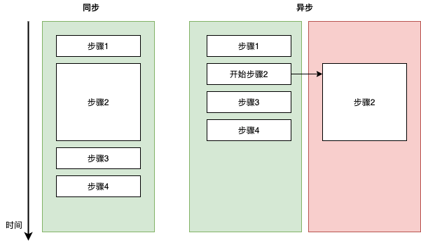

# 关于JavaScript事件循环

## 前言

当谈及Javascript时， 我们常常听到 单线程、异步非阻塞、事件循环这样的关键词，然而它们是什么？ 为什么单线程还可以实现异步？怎么实现？相信这些问题都曾今或正在困扰着许多前端爱好者。通过这篇文章我们将对它们一一梳理。文章将讲解：

- 什么是同步和异步
- 如何通过事件循环在单线程中实现异步
- setTimeout 与 setInverval 为什么不准
- 这些机制是如何影响 web 应用的性能的

如果你对它们感兴趣，就请继续往下读吧。

## 什么是同步和异步

笼统抽象地说：

- 同步 (Synchronous)：同一时间只做一件事，做完一件事才开始下一件。
- 异步 (Asynchronous)：同时可以做N件事，不一定要做完一件才能开始下一件。

回到编程的世界里具体地说：

- 同步：代码是一行一行执行的，一行完成了才会跳到下一行。
- 异步：某一行代码还没完成，我们可以让他执行着先，但我们可以开始下一行。也就实现了我们所谓的并行。

用图表达：

由于步骤2 的执行时间较长，在同步执行过程中他会阻塞步骤3的执行一段时间，反之在异步的机制中，如果我们标明了步骤2是异步的， 那么在完成步骤1之后我们只会开始执行步骤二并让他的另一个世界里执行，然后立刻开始执行步骤3.



用JavaScript来模拟上面的过程：

```javascript
const step1 = () => console.log(1);
const step3 = () => console.log(3);
const step4 = () => console.log(4);

// 用 Promise 简单模拟一个执行时间为1秒，并在结束时候打印2的方程
const step2 = () =>
  new Promise((resolve, _) => {
    setTimeout(() => {
      console.log(2);
      resolve();
    }, 1000);
  });

// 异步机制执行 （JS引擎支持 返回Promise的方法的异步执行，所以我们不需要做额外的包装，直接执行step2,它便是异步执行的）
const asyncExecute = () => {
  step1();
  step2();
  step3();
  step4();
};

// 同步机制执行（如果你不了解async、await不要紧，只要知道 await 后面的执行语句是同步阻塞的）
const syncExecute = async () => {
  step1();
  await step2();
  step3();
  step4();
};

asyncExecute(); // 打印 1 3 4 2
syncExecute(); // 打印 1 2 3 4

```

同步与异步各有优点，同步可以保证执行的顺序，异步可以保证程序的非阻塞。 在一个web应用中，如果我们把向服务端请求一个资源看成一个时间很长的步骤，那么处理这个请求返回信息就需要我们去同步执行。然而在如果我们在请求资源的同时还想让用户可以继续使用我们的应用，那这就需要异步地去实现。 Javascript 和他的引擎给我们提供丰富的资源去实现这两种机制。

讲到这里，也许一切都还有些抽象，但相信在下面的章节里，这一切会变得越来越清晰。


